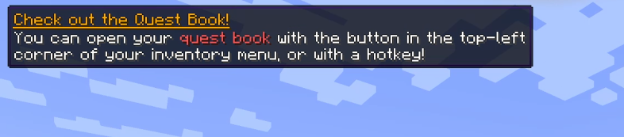
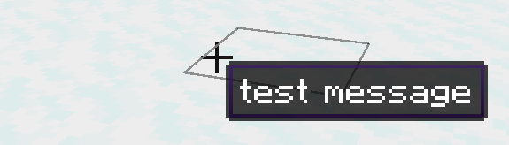

# Styling Messages

Immersive Messages provides a lot of tools to configure the position and style of your messages. Most of these are provided
on the `ImmersiveMessage` object, but some are configured on the animation timeline as well. 


For more animating messages, check out [that section of the guide](/animation).

# Anchoring Text

You can set two parameters to determine how the text attaches to the screen. The first is `anchor()`, which takes a `TextAnchor`
reference, and determines which nine-point location the text should align itself to. For example, the default is `CENTER_CENTER`,
which is right in the middle. But you can also set it to something like `TOP_LEFT` to show messages up there. 



The positioning algorithm will automatically measure the height and width of your message, and align it properly. However, you can also
customize this with `align()`, which again takes a `TextAnchor` but instead controls the relative offset. 



For example, if you wanted your text to appear in the middle of the screen, but not center aligned and instead starting in the lower right quadrant, 
you could set align to `BOTTOM_RIGHT`. You should probably only use this with center-anchored text.

# Setting Initial Positions and Size

`ImmersiveMessage` objects are configured with default position offsets, but you will likely need to change them.
In your builder chain, you can set the initial Y and X positions, as well as the size:

```java
.y(10f)
.x(10f)
.size(1f)
```

These are applied relative to the anchor, so if you anchor to the center of the screen and configure a 50f Y offset, 
your text will appear below the crosshair, above the hotbar.

Please be aware that if you set an initial position, and then override it with an animation transition, 
the transition will take priority. Some methods, like `slideUp()`, will be configured with whatever the Y position was
set at the time, so make sure the initial position functions come *before everything else*.

# Background

You can add a tooltip-like background to text, with an optional border color. By default, the border color will match vanilla item tooltips.

```java
.background() // enables the background rendering
.backgroundColor(new ImmersiveColor(int)) // also takes a regular RGBA int
.borderTopColor(int)
.borderBottomColor(int)
.rainbow()
```

Rainbow will enable an animated RGB border.

# Text Wrap

For long lines of text, Immersive Messages fully supports multi-line wrapping. Configure it with a max text width:

```java
.wrap(100f);
```

If you leave the parameter empty, it will default to zero, which will be interpreted as half the screen width.

# Fonts

Immersive Messages includes a few pre-installed custom fonts that are available when Caxton is loaded. You can still safely
reference them however, and they will fallback to Minecraft built-in font when not available.

```java
.font(ImmersiveFont.ROBOTO)
```

You can also define entirely custom fonts using Caxton. For example, here is the definition for Roboto, in the font folder under your mod ID's assets:

::: code-group
```json [assets/immersivemessages/font/roboto.json]
{
    "providers": [
    {
        "bold": {
            "file": "immersivemessages:roboto_bold.ttf",
            "shadow_offset": 0.5
        },
        "type": "caxton",
        "bold_italic": {
            "file": "immersivemessages:roboto_bolditalic.ttf",
            "shadow_offset": 0.5
        },
        "italic": {
            "file": "immersivemessages:roboto_italic.ttf",
            "shadow_offset": 0.5
        },
        "regular": {
            "file": "immersivemessages:roboto_regular.ttf",
            "shadow_offset": 0.5
        }

    },
    {
        "id": "minecraft:include/space",
        "type": "reference"
    },
    {
        "id": "minecraft:include/default",
        "type": "reference"
    },
    {
        "id": "minecraft:include/unifont",
        "type": "reference"
    }
]}
```
:::

After configuring the font json, you will then need to place the TTF or OTF font source files in 
`/assets/textures/immersivemessages/font/`, including all the files for bold and italic if you are using that.

# Color

You can set the color using a few helper methods:

```java
.color((TextColor) color)
.color((ChatFormatting) color)
.color((int) color)
```

You can also configure color as part of the animation, but alpha is applied separately on a different animation track.

# Accessing Vanilla Styles

Immersive Messages provides a few helpers like `italic()` and `bold()` for setting some vanilla `Style` parameters, but you
can also access it directly with the style builder helper:

```java
.style(style -> style.withUnderlined(true))
```

# Shadow

Shadows are on by default, but you can turn them off:

```java
.shadow(false)
```

# Custom Helper Methods

You can automate common styles with helper methods:

```java
.apply(MyStyle::apply)
    
public static ImmersiveMessage apply(ImmersiveMessage message) {
    return message.italic().bold();
}

```

# Subtext

Immersive Messages provides a powerful subtext system that lets you attach messages to other messages, and renders them recursively! 
This allows for things like subtitles.

Since they're fully separate `ImmersiveMessage` objects, you can apply custom animations to both the main and subtitle tracks separately.
When you use it, you'll receive a builder function for configuring the subtext from within the `ImmersiveMessage` chain.

For example, here is the code for the [Popup message preset](/presets), which renders the main title in gold and uses subtext for the message:

```java
return ImmersiveMessage.builder(duration, title)
      .anchor(TextAnchor.CENTER_CENTER)
      .wrap(200)
      .size(1f)
      .background()
      .slideUp(0.3f)
      .slideOutDown(0.3f)
      .fadeIn(0.5f)
      .fadeOut(0.5f)
      .color(ChatFormatting.GOLD)
      .style(style -> style.withUnderlined(true))
      .subtext(0f, subtitle, 8f, (subtext) -> subtext
          .anchor(TextAnchor.CENTER_CENTER)
          .wrap(200)
          .size(1f)
          .slideUp(0.3f)
          .slideOutDown(0.3f)
          .fadeIn(0.5f)
          .fadeOut(0.5f)
      );
```

Subtexts by default are configured with a delay and a Y offset. This delay is added to all animation effects, so things like fade in/out work properly.
The Y offset is added based on the main text's current default Y position, so make sure you call `.y()` before adding subtext.

Other things, such as styles and animations, are not copied over by default and will need to be configured again for the subtext.

---
---

For more animating messages, check out the [next page](/animation).